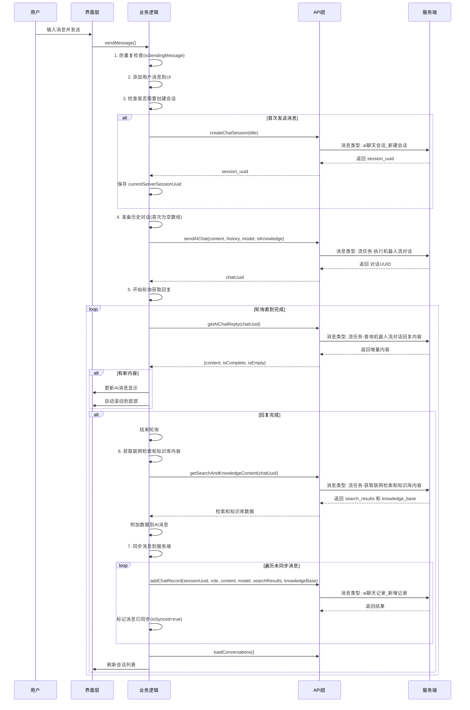
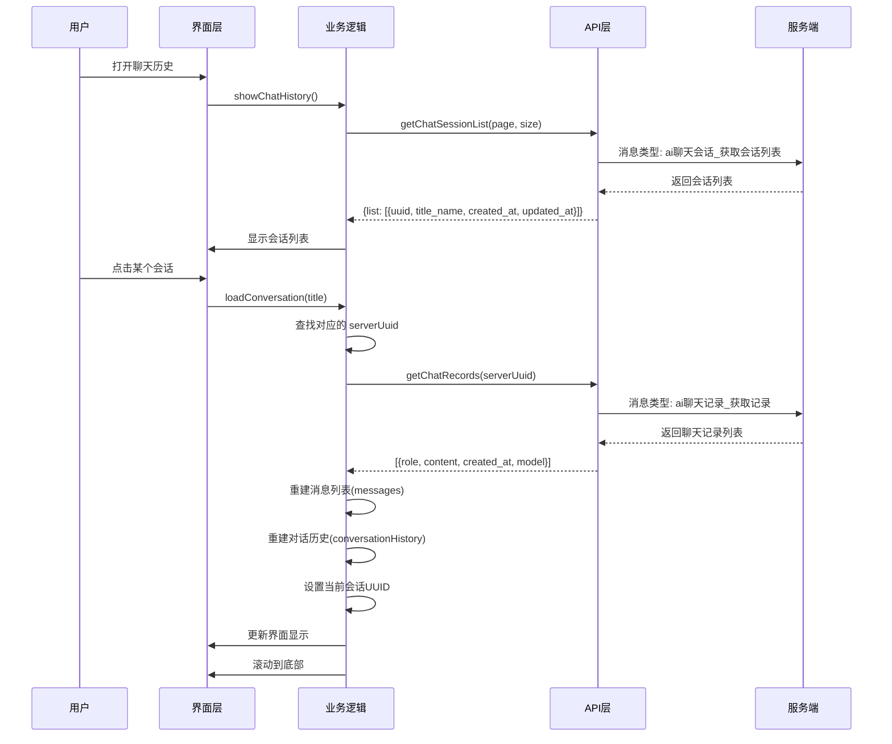
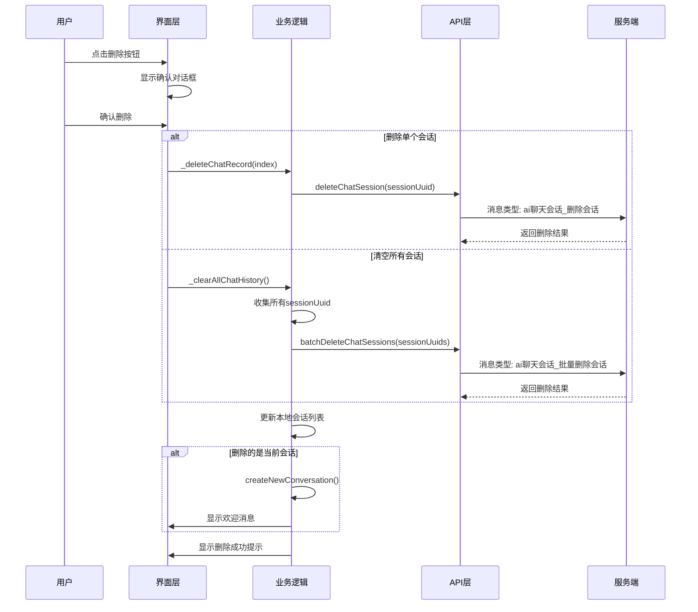

# AI对话功能接口文档

## 一、功能概述

AI对话功能是一个完整的智能问答系统，支持多模型对话（Perplexity、DeepSeek、Hunyuan），具备知识库检索、会话管理、历史记录同步等功能。

---

## 二、接口列表

本文档共记录 **10个核心接口**：
- 核心对话接口：3个（发送消息、获取回复、获取检索和知识库内容）
- 会话管理接口：4个（创建、获取列表、删除、批量删除）
- 聊天记录管理接口：2个（添加记录、获取记录）

### 2.1 核心对话接口

#### 2.1.1 发送AI对话消息

**接口标识**：`sendAIChat`

**消息类型**：`流任务-执行机器人流对话`

**请求参数**：

| 参数名 | 类型 | 必填 | 说明 |
|--------|------|------|------|
| 消息类型 | String | 是 | 固定值：`流任务-执行机器人流对话` |
| 当前请求用户UUID | String | 是 | 用户的内层token（access_token） |
| 命令具体内容 | Object | 是 | 包含对话详细信息 |
| └─ 对话内容Base64 | String | 是 | 用户输入的消息内容，Base64编码 |
| └─ 历史对话json队列 | Array | 是 | 历史对话记录数组，首次对话传空数组`[]` |
| &nbsp;&nbsp;&nbsp;&nbsp;└─ role | String | 是 | 角色：`user`(用户) 或 `assistant`(AI助手) |
| &nbsp;&nbsp;&nbsp;&nbsp;└─ content_base64 | String | 是 | 对话内容，Base64编码 |
| └─ 对话RobotUID | String | 是 | 机器人/模型标识（如：`Perplexity`、`DeepSeek`、`Hunyuan`） |
| └─ is_knowledge_base | Boolean | 是 | 是否开启知识库检索 |

**返回参数**：

| 参数名 | 类型 | 说明 |
|--------|------|------|
| is_success | Boolean | 请求是否成功 |
| result_string | String | JSON字符串，需要解析 |
| └─ 执行结果 | Boolean | 业务执行是否成功 |
| └─ 返回数据 | Object | 返回的业务数据 |
| &nbsp;&nbsp;&nbsp;&nbsp;└─ 对话UUID | String | **关键**：用于后续轮询获取AI回复的唯一标识 |

**调用示例**（api_service.dart:522-576）：

```dart
// 首次发送消息，历史对话传空数组
final chatUuid = await ApiService().sendAIChat(
  '你好，请介绍一下你自己',
  [], // 空历史
  'DeepSeek',
  true // 开启知识库
);

// 后续对话，需要传递历史记录
final chatUuid2 = await ApiService().sendAIChat(
  '那你能做什么？',
  [
    {'role': 'user', 'content_base64': 'base64编码的第一条用户消息'},
    {'role': 'assistant', 'content_base64': 'base64编码的第一条AI回复'}
  ],
  'DeepSeek',
  true
);
```

---

#### 2.1.2 获取AI对话回复

**接口标识**：`getAIChatReply`

**消息类型**：`流任务-查询机器人流对话回复内容`

**请求参数**：

| 参数名 | 类型 | 必填 | 说明 |
|--------|------|------|------|
| 消息类型 | String | 是 | 固定值：`流任务-查询机器人流对话回复内容` |
| 当前请求用户UUID | String | 是 | 用户的内层token |
| 命令具体内容 | Object | 是 | 包含查询参数 |
| └─ 对话UUID | String | 是 | 从`sendAIChat`接口返回的`对话UUID` |
| └─ 最多等待毫秒 | Integer | 是 | 建议值：200ms，控制轮询等待时间 |

**返回参数**：

| 参数名 | 类型 | 说明 |
|--------|------|------|
| is_success | Boolean | 请求是否成功 |
| result_string | String | JSON字符串，需要解析 |
| └─ 执行结果 | Boolean | 业务执行是否成功 |
| └─ 返回数据 | Object | 返回的业务数据 |
| &nbsp;&nbsp;&nbsp;&nbsp;└─ 内容Base64 | String | AI回复的增量内容（Base64编码），可能为空 |
| &nbsp;&nbsp;&nbsp;&nbsp;└─ 是否完成 | Boolean | **关键**：标识AI回复是否完成，`true`时停止轮询 |

**轮询策略**（ai_qus_logic.dart:418-544）：

```dart
// 1. 初始延迟：200ms（有新内容时）
// 2. 中期延迟：300-500ms（无新内容但未超时）
// 3. 长期延迟：1000ms（长时间无内容）
// 4. 最大空轮询次数：50次连续空内容后停止
// 5. 完成条件：返回数据中 is_complete == true
```

**调用示例**（ai_qus_logic.dart:427-543）：

```dart
// 递归轮询获取AI回复
Future<void> _pollForReplyOnce(int messageIndex) async {
  final reply = await ApiService().getAIChatReply(chatUuid);

  if (reply != null) {
    final content = reply['content']; // 已自动Base64解码
    final isComplete = reply['isComplete'];

    if (content != null && content.isNotEmpty) {
      // 累加内容，更新UI
      state.currentAiReply.value += content;
    }

    if (isComplete) {
      // 完成，停止轮询
      _finishStreaming(messageIndex);
      return;
    }

    // 继续下一次轮询
    Future.delayed(Duration(milliseconds: nextDelay), () {
      _pollForReplyOnce(messageIndex);
    });
  }
}
```

---

#### 2.1.3 获取联网检索和知识库内容

**接口标识**：`getSearchAndKnowledgeContent`

**消息类型**：`流任务-获取联网检索和知识库内容`

**请求参数**：

| 参数名 | 类型 | 必填 | 说明 |
|--------|------|------|------|
| 消息类型 | String | 是 | 固定值：`流任务-获取联网检索和知识库内容` |
| 当前请求用户UUID | String | 是 | 用户的内层token |
| 命令具体内容 | Object | 是 | 包含查询参数 |
| └─ 对话UUID | String | 是 | 从`sendAIChat`接口返回的`对话UUID` |

**返回参数**：

| 参数名 | 类型 | 说明 |
|--------|------|------|
| is_success | Boolean | 请求是否成功 |
| result_string | String | JSON字符串，需要解析 |
| └─ 执行结果 | Boolean | 业务执行是否成功 |
| └─ 返回数据 | Object | 返回的业务数据 |
| &nbsp;&nbsp;&nbsp;&nbsp;└─ search_results | Array | 联网检索结果列表 |
| &nbsp;&nbsp;&nbsp;&nbsp;&nbsp;&nbsp;&nbsp;&nbsp;└─ title | String | 检索结果标题 |
| &nbsp;&nbsp;&nbsp;&nbsp;&nbsp;&nbsp;&nbsp;&nbsp;└─ url | String | 检索结果链接 |
| &nbsp;&nbsp;&nbsp;&nbsp;&nbsp;&nbsp;&nbsp;&nbsp;└─ snippet | String | 检索结果摘要 |
| &nbsp;&nbsp;&nbsp;&nbsp;&nbsp;&nbsp;&nbsp;&nbsp;└─ source | String | 来源网站名称 |
| &nbsp;&nbsp;&nbsp;&nbsp;└─ knowledge_base | Array | 知识库内容列表 |
| &nbsp;&nbsp;&nbsp;&nbsp;&nbsp;&nbsp;&nbsp;&nbsp;└─ title | String | 知识库文档标题 |
| &nbsp;&nbsp;&nbsp;&nbsp;&nbsp;&nbsp;&nbsp;&nbsp;└─ content | String | 知识库文档内容片段 |
| &nbsp;&nbsp;&nbsp;&nbsp;&nbsp;&nbsp;&nbsp;&nbsp;└─ doc_id | String | 知识库文档ID |
| &nbsp;&nbsp;&nbsp;&nbsp;&nbsp;&nbsp;&nbsp;&nbsp;└─ relevance_score | Float | 相关度评分(0-1) |

**调用时机**（ai_qus_logic.dart:619-649）：

- AI回复完成后立即调用
- 获取到的检索和知识库内容会附加到AI消息中
- 用于展示AI回复的参考来源和知识库依据

**调用示例**（api_service.dart:671-716）：

```dart
// 在AI回复完成后获取检索和知识库内容
final result = await ApiService().getSearchAndKnowledgeContent(chatUuid);

if (result != null) {
  final searchResults = result['search_results'] as List; // 联网检索结果
  final knowledgeBase = result['knowledge_base'] as List; // 知识库内容

  print('检索结果数量: ${searchResults.length}');
  print('知识库数量: ${knowledgeBase.length}');
}
```

---

### 2.2 会话管理接口

#### 2.2.1 创建聊天会话

**接口标识**：`createChatSession`

**消息类型**：`ai聊天会话_新建会话`

**请求参数**：

| 参数名 | 类型 | 必填 | 说明 |
|--------|------|------|------|
| 消息类型 | String | 是 | 固定值：`ai聊天会话_新建会话` |
| 当前请求用户UUID | String | 是 | 用户的内层token |
| 命令具体内容 | Object | 是 | 包含会话信息 |
| └─ session_name | String | 是 | 会话标题，建议取用户首条消息前20字符 |

**返回参数**：

| 参数名 | 类型 | 说明 |
|--------|------|------|
| is_success | Boolean | 请求是否成功 |
| result_string | String | JSON字符串，需要解析 |
| └─ 执行结果 | Boolean | 业务执行是否成功 |
| └─ 返回数据 | Object | 返回的业务数据 |
| &nbsp;&nbsp;&nbsp;&nbsp;└─ session_uuid | String | **关键**：会话的唯一标识，用于后续记录同步 |

**调用时机**（ai_qus_logic.dart:213-255）：

- 用户首次发送消息时自动创建
- 会话标题取用户第一条消息的前20个字符

---

#### 2.2.2 获取会话列表

**接口标识**：`getChatSessionList`

**消息类型**：`ai聊天会话_获取会话列表`

**请求参数**：

| 参数名 | 类型 | 必填 | 说明 |
|--------|------|------|------|
| 消息类型 | String | 是 | 固定值：`ai聊天会话_获取会话列表` |
| 当前请求用户UUID | String | 是 | 用户的内层token |
| 命令具体内容 | Object | 是 | 包含分页参数 |
| └─ current_page | Integer | 是 | 当前页码，从1开始 |
| └─ page_size | Integer | 是 | 每页数量，建议50 |

**返回参数**：

| 参数名 | 类型 | 说明 |
|--------|------|------|
| is_success | Boolean | 请求是否成功 |
| result_string | String | JSON字符串，需要解析 |
| └─ 执行结果 | Boolean | 业务执行是否成功 |
| └─ 返回数据 | Object | 返回的业务数据 |
| &nbsp;&nbsp;&nbsp;&nbsp;└─ list | Array | 会话列表 |
| &nbsp;&nbsp;&nbsp;&nbsp;&nbsp;&nbsp;&nbsp;&nbsp;└─ uuid | String | 会话UUID |
| &nbsp;&nbsp;&nbsp;&nbsp;&nbsp;&nbsp;&nbsp;&nbsp;└─ title_name | String | 会话标题 |
| &nbsp;&nbsp;&nbsp;&nbsp;&nbsp;&nbsp;&nbsp;&nbsp;└─ created_at | String | 创建时间（ISO 8601格式） |
| &nbsp;&nbsp;&nbsp;&nbsp;&nbsp;&nbsp;&nbsp;&nbsp;└─ updated_at | String | 更新时间（ISO 8601格式） |

**调用时机**（ai_qus_logic.dart:1250-1310）：

- 页面初始化时加载
- 创建新会话后刷新列表
- 删除会话后刷新列表

---

#### 2.2.3 删除聊天会话

**接口标识**：`deleteChatSession`

**消息类型**：`ai聊天会话_删除会话`

**请求参数**：

| 参数名 | 类型 | 必填 | 说明 |
|--------|------|------|------|
| 消息类型 | String | 是 | 固定值：`ai聊天会话_删除会话` |
| 当前请求用户UUID | String | 是 | 用户的内层token |
| 命令具体内容 | Object | 是 | 包含会话标识 |
| └─ session_uuid | String | 是 | 要删除的会话UUID |

**返回参数**：

| 参数名 | 类型 | 说明 |
|--------|------|------|
| is_success | Boolean | 请求是否成功 |
| result_string | String | JSON字符串 |
| └─ 执行结果 | Boolean | 删除是否成功 |
| └─ 返回消息 | String | 结果消息 |

---

#### 2.2.4 批量删除会话

**接口标识**：`batchDeleteChatSessions`

**消息类型**：`ai聊天会话_批量删除会话`

**请求参数**：

| 参数名 | 类型 | 必填 | 说明 |
|--------|------|------|------|
| 消息类型 | String | 是 | 固定值：`ai聊天会话_批量删除会话` |
| 当前请求用户UUID | String | 是 | 用户的内层token |
| 命令具体内容 | Object | 是 | 包含会话标识列表 |
| └─ session_uuids | Array | 是 | 要删除的会话UUID数组 |

**返回参数**：同单个删除接口

**调用时机**（ai_qus_logic.dart:1462-1500）：

- 用户清空所有历史记录时调用

---

### 2.3 聊天记录管理接口

#### 2.3.1 添加聊天记录

**接口标识**：`addChatRecord`

**消息类型**：`ai聊天记录_新增记录`

**请求参数**：

| 参数名 | 类型 | 必填 | 说明 |
|--------|------|------|------|
| 消息类型 | String | 是 | 固定值：`ai聊天记录_新增记录` |
| 当前请求用户UUID | String | 是 | 用户的内层token |
| 命令具体内容 | Object | 是 | 包含记录详情 |
| └─ session_uuid | String | 是 | 所属会话的UUID |
| └─ role | String | 是 | 角色：`user` 或 `assistant` |
| └─ content | String | 是 | 消息内容（原文，非Base64） |
| └─ factory_name | String | 否 | AI厂商名称，默认`OpenAI` |
| └─ model | String | 否 | 模型名称，如`Perplexity`、`DeepSeek`、`Hunyuan` |
| └─ token_count | Integer | 否 | Token消耗数，默认0 |
| └─ search_results | Array | 否 | **新增**：联网检索结果列表（仅assistant角色时可能有） |
| &nbsp;&nbsp;&nbsp;&nbsp;└─ title | String | - | 检索结果标题 |
| &nbsp;&nbsp;&nbsp;&nbsp;└─ url | String | - | 检索结果链接 |
| &nbsp;&nbsp;&nbsp;&nbsp;└─ snippet | String | - | 检索结果摘要 |
| &nbsp;&nbsp;&nbsp;&nbsp;└─ source | String | - | 来源网站名称 |
| └─ knowledge_base | Array | 否 | **新增**：知识库内容列表（仅assistant角色时可能有） |
| &nbsp;&nbsp;&nbsp;&nbsp;└─ title | String | - | 知识库文档标题 |
| &nbsp;&nbsp;&nbsp;&nbsp;└─ content | String | - | 知识库文档内容片段 |
| &nbsp;&nbsp;&nbsp;&nbsp;└─ doc_id | String | - | 知识库文档ID |
| &nbsp;&nbsp;&nbsp;&nbsp;└─ relevance_score | Float | - | 相关度评分(0-1) |

**返回参数**：

| 参数名 | 类型 | 说明 |
|--------|------|------|
| is_success | Boolean | 请求是否成功 |
| result_string | String | JSON字符串 |
| └─ 执行结果 | Boolean | 添加是否成功 |
| └─ 返回消息 | String | 结果消息 |

**调用时机**（ai_qus_logic.dart:257-322）：

- AI回复完成后，批量同步未同步的消息记录
- 采用增量同步策略，每条消息标记`isSynced`字段避免重复同步
- 同步assistant角色消息时，会自动提取并传递search_results和knowledge_base（如果存在）

**调用示例**（api_service.dart:578-668）：

```dart
// 普通用户消息同步（无检索和知识库内容）
await ApiService().addChatRecord(
  sessionUuid: sessionUuid,
  role: 'user',
  content: '用户输入的消息',
  model: 'DeepSeek'
);

// AI消息同步（包含检索和知识库内容）
await ApiService().addChatRecord(
  sessionUuid: sessionUuid,
  role: 'assistant',
  content: 'AI的回复内容',
  model: 'DeepSeek',
  searchResults: [
    {
      'title': '搜索结果标题',
      'url': 'https://example.com',
      'snippet': '搜索结果摘要...',
      'source': 'Example网站'
    }
  ],
  knowledgeBase: [
    {
      'title': '知识库文档标题',
      'content': '文档内容片段...',
      'doc_id': 'doc_123456',
      'relevance_score': 0.95
    }
  ]
);
```

---

#### 2.3.2 获取聊天记录

**接口标识**：`getChatRecords`

**消息类型**：`ai聊天记录_获取记录`

**请求参数**：

| 参数名 | 类型 | 必填 | 说明 |
|--------|------|------|------|
| 消息类型 | String | 是 | 固定值：`ai聊天记录_获取记录` |
| 当前请求用户UUID | String | 是 | 用户的内层token |
| 命令具体内容 | Object | 是 | 包含会话标识 |
| └─ session_uuid | String | 是 | 要查询的会话UUID |

**返回参数**：

| 参数名 | 类型 | 说明 |
|--------|------|------|
| is_success | Boolean | 请求是否成功 |
| result_string | String | JSON字符串 |
| └─ 执行结果 | Boolean | 查询是否成功 |
| └─ 返回数据 | Array | 聊天记录列表 |
| &nbsp;&nbsp;&nbsp;&nbsp;└─ role | String | 角色：`user` 或 `assistant` |
| &nbsp;&nbsp;&nbsp;&nbsp;└─ content | String | 消息内容 |
| &nbsp;&nbsp;&nbsp;&nbsp;└─ created_at | String | 创建时间 |
| &nbsp;&nbsp;&nbsp;&nbsp;└─ model | String | 使用的AI模型 |

**调用时机**（ai_qus_logic.dart:1353-1422）：

- 用户从历史列表点击某个会话时加载
- 加载完成后重建本地消息列表和对话历史

---

## 三、完整业务流程

### 3.1 发送消息流程



### 3.2 加载历史会话流程



### 3.3 删除会话流程



---

## 四、关键技术细节

### 4.1 历史对话格式要求

**关键原则**：严格的一问一答交替格式

```dart
// ✅ 正确格式（user → assistant → user → assistant）
[
  {'role': 'user', 'content_base64': '...'},
  {'role': 'assistant', 'content_base64': '...'},
  {'role': 'user', 'content_base64': '...'},
  {'role': 'assistant', 'content_base64': '...'}
]

// ❌ 错误格式（连续的user或assistant）
[
  {'role': 'user', 'content_base64': '...'},
  {'role': 'user', 'content_base64': '...'}, // 错误！
  {'role': 'assistant', 'content_base64': '...'}
]
```

**处理逻辑**（ai_qus_logic.dart:326-416）：

1. 首次发送消息时，历史记录传空数组`[]`
2. 后续对话时，只传递完整的`user-assistant`对话对
3. 自动过滤错误消息、系统消息、临时消息
4. 确保角色严格交替，不符合顺序的消息自动跳过
5. 如果最后一条是孤立的user消息，会被移除

### 4.2 消息同步标记机制

**目的**：避免重复同步消息到服务端

**实现**（ai_qus_logic.dart:257-322）：

```dart
// 每条消息都有 isSynced 标记
{
  'isUser': true,
  'content': '用户消息',
  'isSynced': false, // 未同步
  'aiSource': 'DeepSeek'
}

// 同步后更新标记
message['isSynced'] = true;

// 只同步未同步的消息
final unsyncedMessages = state.messages.where((msg) =>
  msg['isError'] != true &&
  msg['isSystem'] != true &&
  msg['isTemporary'] != true &&
  msg['content']?.toString().isNotEmpty == true &&
  msg['isSynced'] != true // 关键过滤条件
).toList();
```

### 4.3 AI回复失败的事务性回滚

**问题场景**：AI回复失败时，用户消息已发送，但AI无有效回复

**解决方案**（ai_qus_logic.dart:586-617）：

```dart
if (isAiReplyEmpty) {
  print('🔧 AI回复失败，执行事务性回滚，移除失败的对话对');

  // 1. 移除AI错误消息
  state.messages.removeAt(messageIndex);

  // 2. 查找并移除对应的用户消息
  for (int i = state.messages.length - 1; i >= 0; i--) {
    if (state.messages[i]['isUser'] == true &&
        state.messages[i]['isSynced'] == false) {
      state.messages.removeAt(i);
      break;
    }
  }

  // 3. 显示临时错误提示（不保存到历史）
  state.messages.add({
    'isUser': false,
    'content': '抱歉，我现在无法回答您的问题，请稍后再试。',
    'isError': true,
    'isTemporary': true, // 临时消息，不会同步到服务端
    'isSystem': true
  });
}
```

### 4.4 轮询策略优化

**动态调整延迟**（ai_qus_logic.dart:546-560）：

```dart
int _calculateNextDelay(bool hasNewContent, int emptyCount) {
  if (hasNewContent) {
    return 200;  // 有新内容：快速轮询200ms
  } else if (emptyCount < 5) {
    return 300;  // 开始阶段：300ms
  } else if (emptyCount < 20) {
    return 500;  // 中期阶段：500ms
  } else {
    return 1000; // 长时间无内容：降低到1000ms
  }
}
```

**超时保护**：

- 连续50次空内容后自动停止轮询
- 网络错误连续10次后停止轮询
- 支持`isComplete`标志立即停止

---

## 五、接口调用时序图

### 5.1 完整对话时序

```
用户输入 → 创建会话(首次) → 发送AI对话 → 获取对话UUID → 开始轮询
                                                              ↓
                                                         获取增量回复
                                                              ↓
                                                         更新UI显示
                                                              ↓
                                                    检查是否完成(isComplete)
                                                              ↓
                                              ┌─────────────────┴────────────────┐
                                              ↓                                  ↓
                                         继续轮询                            回复完成
                                              ↑                                  ↓
                                              └──────────────────────────同步消息记录
                                                                                 ↓
                                                                          刷新会话列表
```

### 5.2 接口依赖关系

```
sendAIChat (发送消息)
    ↓ 返回 chatUuid
getAIChatReply (轮询获取回复) - 依赖 chatUuid
    ↓ 回复完成后
getSearchAndKnowledgeContent (获取检索和知识库内容) - 依赖 chatUuid
    ↓ 返回 search_results 和 knowledge_base
addChatRecord (同步消息) - 依赖 sessionUuid, 可选传递 searchResults 和 knowledgeBase
    ↓
getChatSessionList (刷新列表)
```

---

## 六、错误处理

### 6.1 常见错误场景

| 错误场景 | 处理策略 | 代码位置 |
|---------|---------|---------|
| Token为空 | 返回null，不发起请求 | api_service.dart:524-530 |
| 发送消息失败 | 显示错误消息，不创建会话 | ai_qus_logic.dart:177-192 |
| 轮询超时 | 连续50次空内容后停止，显示错误提示 | ai_qus_logic.dart:483-486 |
| AI回复失败 | 事务性回滚，移除失败对话对 | ai_qus_logic.dart:586-617 |
| 网络异常 | 重试机制（指数退避），最多10次 | ai_qus_logic.dart:520-543 |
| 同步失败 | 保持isSynced=false，下次继续尝试 | ai_qus_logic.dart:308-315 |

### 6.2 防重复发送机制

```dart
// 发送消息前检查
if (state.isSendingMessage.value) {
  print('🚫 消息正在发送中，请等待当前消息处理完毕');
  return;
}

// 设置发送状态
state.isSendingMessage.value = true;

// 发送完成或失败后清除状态
state.isSendingMessage.value = false;
```

---

## 七、性能优化建议

### 7.1 已实现的优化

1. **增量同步**：只同步未标记`isSynced`的消息
2. **动态轮询延迟**：根据响应情况调整轮询频率
3. **Base64编码**：传输前压缩内容体积
4. **批量操作**：支持批量删除会话减少请求次数

### 7.2 潜在优化点

1. **消息分页加载**：当历史消息过多时，考虑分页加载
2. **本地缓存**：将最近会话缓存到本地，减少服务端请求
3. **WebSocket替代轮询**：如果服务端支持，使用WebSocket推送可提升实时性
4. **消息去重**：在同步前检查服务端是否已存在相同消息

---

## 八、附录

### 8.1 消息类型枚举

| 消息类型 | 说明 |
|---------|------|
| `流任务-执行机器人流对话` | 发送AI对话消息 |
| `流任务-查询机器人流对话回复内容` | 获取AI回复 |
| `流任务-获取联网检索和知识库内容` | **新增**：获取联网检索结果和知识库内容 |
| `ai聊天会话_新建会话` | 创建聊天会话 |
| `ai聊天会话_获取会话列表` | 获取会话列表 |
| `ai聊天会话_修改会话` | 修改会话标题 |
| `ai聊天会话_删除会话` | 删除单个会话 |
| `ai聊天会话_批量删除会话` | 批量删除会话 |
| `ai聊天记录_新增记录` | 添加聊天记录 |
| `ai聊天记录_获取记录` | 获取聊天记录 |

### 8.2 角色枚举

| 角色值 | 说明 |
|--------|------|
| `user` | 用户消息 |
| `assistant` | AI助手消息 |

### 8.3 AI模型标识

| 模型标识 | 说明 |
|---------|------|
| `Perplexity` | Perplexity AI模型 |
| `DeepSeek` | DeepSeek AI模型 |
| `Hunyuan` | 腾讯混元大模型 |

---

## 九、开发者注意事项

### 9.1 必须遵守的规则

1. **历史对话格式**：严格保证`user-assistant`交替，首次发送传空数组
2. **消息标记**：所有新消息必须标记`isSynced: false`
3. **系统消息排除**：带有`isSystem: true`的消息不计入历史对话
4. **错误消息处理**：`isError: true`的消息不同步到服务端
5. **临时消息**：`isTemporary: true`的消息不同步，仅用于UI提示

### 9.2 调试技巧

```dart
// 1. 查看历史对话格式是否正确
print('📋 历史记录角色顺序: ${historyForAPI.map((m) => m['role']).join(' -> ')}');

// 2. 追踪同步状态
print('🚀 开始同步 ${unsyncedMessages.length} 条新消息到服务端');
print('✅ 聊天记录同步完成: $successCount/${unsyncedMessages.length} 条成功');

// 3. 监控轮询状态
print('🔄 轮询次数: ${state.pollCount}, 空内容计数: ${state.emptyContentCount}');
```

---

## 十、版本更新记录

### v1.1（2025年10月13日）
**新增功能**：
- 新增接口：`getSearchAndKnowledgeContent`（获取联网检索和知识库内容）
- 修改接口：`addChatRecord` 新增可选参数 `search_results` 和 `knowledge_base`

**业务流程调整**：
- AI回复完成后，新增获取检索和知识库内容的步骤
- 同步消息记录时，支持传递检索和知识库数据

**文档更新**：
- 更新章节2.1.3：新增接口详细说明
- 更新章节2.3.1：添加新增参数说明和调用示例
- 更新章节3.1：更新发送消息流程序列图
- 更新章节5.2：更新接口依赖关系图
- 更新章节8.1：新增消息类型枚举

### v1.0（2025年10月）
- 初始版本，包含9个核心接口的完整文档

---

**文档版本**：v1.1
**最后更新**：2025年10月13日
**维护者**：开发团队
